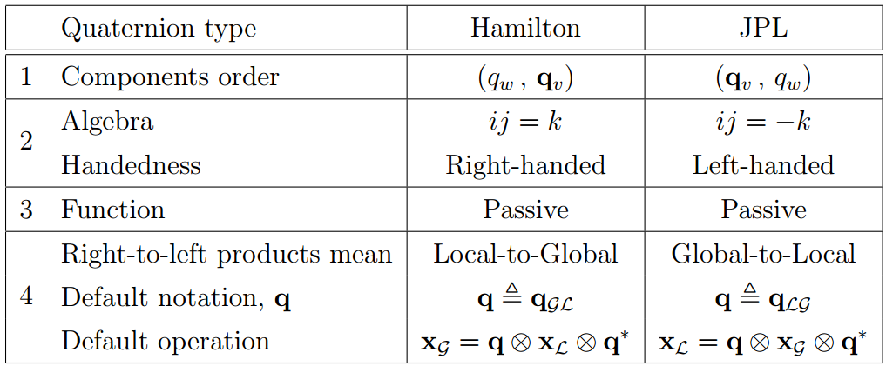

# Quaternions

## Quaternion Conventions

There are several ways to determine the quaternion. They are basically
related to four binary choices:

1. Real first or last
2. Multiplication formula - definition of the quaternion algebra (right vs
   left handedness)
3. Function of the rotation operator - rotating frames or rotating vectors:
4. In the passive case, the direction of the operation (local-to-global or
   global-to-local)

