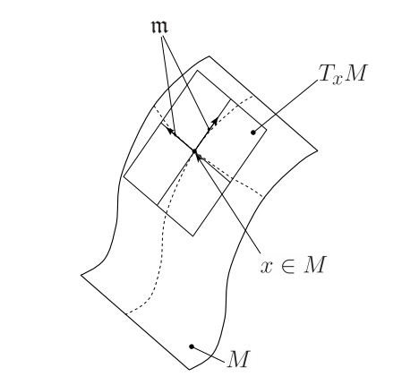

# Manifold

An $N$-dimensional manifold $M$ is a topological space where every point $p \in
M$ is endowed with local Euclidean structure. Another way of saying it: the
neighborhood of every point $p$ is homeomorphic to {\rm I\!R}^{N}.

One dimensional manifolds includ lines and circles, but not figure eights
(because they have crossing points that are not locally homeomorphic to
Euclidean 1-space). Two dimensional manifolds are also called surfaces.
Examples include the plane, the sphere, and the torus, which can all be
embedded (formed without self-intersections) in three dimensional real space,
but also the Klein bottole and real projective plane, which will always self
intersect when immersed in three-dimensional real space.

Although a manifold locally resembles Euclidean space, globally it may not. For
example, the surface of the sphere is not a Euclidean space, but in a region it
can be charted by means of map projections of the region into the Euclidean
plane (in the context of manifolds they are called charts). When a region
appears in two neighbouring charts, the two representations do not coincide
exactly and a transformation is needed to pass from one to the other, called a
transition map.

From an intuitive point of view, in an infinitely small vicinity of a point $p$
the space looks "flat". A good way to visualize it is to think of the surface
of the Earth, a manifold of dimension 2 (we can move in two perpendicular
directions, North-South and East-West). Although it is curved, at a given point
it looks "flat", or a ${\rm I\!R}^{2}$ Euclidean space.

An illustration of the elements introduced: a sample 2D manifold $M$ (embedded
in 3D-space), a point on it $x \in M$, the tangent space at $x$ denoted by
$T_{x}M$ and the algebra $m$ and the vectorial base of that space.

## Tangent space of a manifold

A $D$-dimensional manifold $M$ embedded in $R^{N}$ (with $N \geq D$) has
associated an N-dimensional tangent space for every point $p \in M$. This
space is denoted as $T_{x}M$ and in non-singular points has a dimensionality of
$D$ (identical to that of the manifold).

Informally, a tangent space can be visualized as the vector space of the
derivatives at $p$ of all possible smooth curves that pass through $p$, e.g.
$T_{x}M$ contains all the possible "velocity" vectors of a particle at $p$ and
constrained to $M$.
