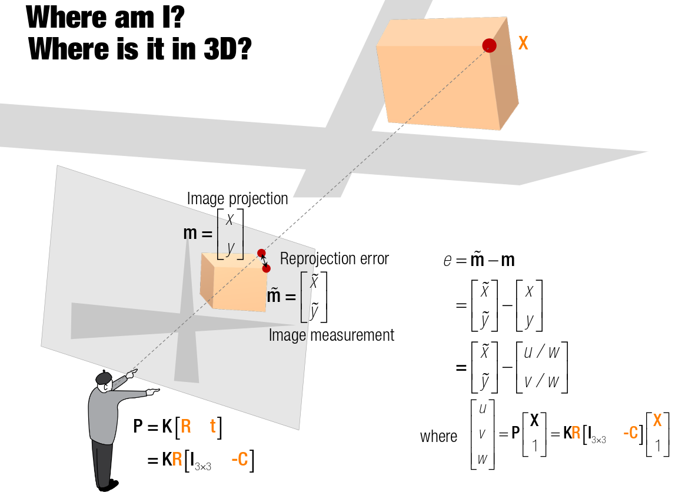

# Bundle Adjustment And Nonlinear Optimization

In the eight-point algorithm a linear approach was used to solve the structure
and motion problem. In particular, the eight-point algorithm provides a closed
form solutions to estimate the camera parameters and the 3D structure, based on
SVD.

However, if we have noisy data $x_{1}$ and $x_{2}$ where the correspondences
are not exact or correct then we have **no guarantee** that:

1. $R$ and $T$ are as close as possible to the true solution
2. Consistent recontruction can be obtained

In order to take noise and statistical fluctuation into account, one can revert
to a Bayesian formulation and determine the most likely camera transformation
$R$, $T$ and 'true' 2D coordinates $x$ given the measured coordinates
$\tilde{x}$, by performing a **maximum aposteriori estimate**:

\begin{equation}
    \arg\max_{x, R, T} P(x, R, T \mid \tilde{x}) =
        \arg\max_{x, R, T} P(\tilde{x} \mid x, R, T) P (x, R, T)
\end{equation}

This approach will however involve modeling probability densities $P$ on the
fairly compicated space $SO(3) \times \mathbb{S}^{3}$ of rotation and
translation parameters, as $R \in SO(3)$ and $T \in \mathbb{S}^{2}$ (3D
translation with unit length).

## What is Bundle Adjustment
Given a set of images depicting a number of 3D points from different
viewpoints, bundle adjustment can be defined as the problem of simultaneously
refining the 3D coordinates describing the scene geometry, the parameters of
the relative motion, and optical characteristics of the cameras employed to
acquire the images according to an optimality criterion involing the
corresponding image projections of all points.

Bundle adjustment is almost used as the last step of every feature-based 3D
reconstruction algorithm. It amounts to an optimization problem on the 3D
structure and viewing parameters (i.e. camera pose and possibly intrinsic
calibration and radial distorition), to obtain a reconstruction which is
optimal under certain assumptions regarding the noise pertaining to the
observed image features: if the image error is zero-mean Gaussian, then bundle
adjustment is the Maximum Likelihood Estimator (MLE).

The name bundle adjustment refers to the the bundles of light rays originating
from each 3D feature and converging on each camera's optical center, which are
adjusted optimally with respect to both the structure and viewing parameters
(similarity in meaning to categorical bundle seems purely coincidental).

Bundle adjustment boils down to minimizing the reprojection error between the
image locations of observed and predicted image points, which is expressed as
the sum of squares of a large number of nonlinear, real-valued functions. The
minimization is achieved using nonlinear least-squares algorithms. Of these,
Levenberg-Marquardt is commonly used due to its ease of implementation and its
use of an effective damping strategy that lends it the ability to converge
quickly from a wide range of initial guesses.

Let $m$ and $\tilde{m}$ be the image projection and image measurement
(observed) in image coordinates (**not homogeneous coordinates**). The
reprojection error $e$ is defined as the distance between $\tilde{m}$ and $m$.

\begin{equation}
    e = \tilde{m} - m
\end{equation}

In this scenario we have a given image measurement $\tilde{m}$, our goal is to
find the image projection $m$ that minizmies the reprojection error $e$. The
image projection $m$ can be converted to homogeneous coordinates $u, v, w$ by:

\begin{align}
      m =
        \begin{bmatrix}
            x \\
            y
        \end{bmatrix}
      =
        \begin{bmatrix}
            u / w \\
            v / w
        \end{bmatrix}
\end{align}

It can be found by:

\begin{align}
    \begin{bmatrix}
        u \\
        v \\
        w
    \end{bmatrix} &=
    P
    \begin{bmatrix}
        X \\
        1
    \end{bmatrix} \\
    \begin{bmatrix}
        u \\
        v \\
        w
    \end{bmatrix} &=
    K
    R
    \begin{bmatrix}I_{3 \times 3} & -C\end{bmatrix}
    \begin{bmatrix}X \\ 1\end{bmatrix}
\end{align}

Where

- $P$: projection matrix
- $K$: camera intrinsic matrix
- $I$: identity matrix ($3 \times 3$ matrix)
- $R$: rotation matrix
- $C$: camera center
- $X$: 3D point in world ($3 \times 1$ vector)

Note that the projection matrix $P$ can be decomposed in terms of the camera
intrinsics matrix $K$, rotation matrix $R$ and camera center $C$, this is
useful because it enables us to obtain the physical transformation (rotation
and translation) from $R$ and $C$.

The cost function can be rewritten as:

\begin{equation}
    \min_{R, C, X} \left|\left|
        \begin{bmatrix}
            \tilde{x} \\
            \tilde{y}
        \end{bmatrix} -
        \begin{bmatrix}
            u(R, C, X) / w(R, C, X) \\
            v(R, C, X) / w(R, C, X)
        \end{bmatrix}
    \right|\right|^{2}
\end{equation}

There is one problem with the above cost function though, specifically with the
rotation matrix $R$ where Euler angles are commonly assumed to be extracted.
Euler angles however are known to have singular issues (aka gimbal lock),
quaternions on the other hand do not, we therefore specify here that the
rotation matrix $R$ above is parameterized with quaternions.  A quaternion $q =
(x, y, z, w)$ can be converted into a rotation matrix via

\begin{equation}
    R = \begin{bmatrix}
        1 - 2q_{y}^{2} - 2q_{z}^{2}
            & 2q_{x}q_{y} + 2q_{w}q_{z}
            & 2q_{x}q_{z} - 2q_{w}q_{y} \\
        2 q_{x}q_{y} - 2q_{w}q_{z}
            & 1 - 2q_{x}^{2} - 2q_{z}^{2}
            &  2q_{y}q_{z} + 2q_{w}q_{x} \\
        2 q_{x}q_{z} - 2q_{w}q_{y}
            & 2q_{y}q_{z} - 2q_{w}q_{x}
            & 1 - 2q_{x}^{2} - 2q_{y}^{2}
    \end{bmatrix}
\end{equation}

The rotation matrix $R$ parameterized by a quaternion is denoted by $R(q)$, the
cost function with modified notation becomes.

\begin{equation}
    \min_{q, C, X} \left|\left|
        \begin{bmatrix}
            \tilde{x} \\
            \tilde{y}
        \end{bmatrix} -
        \begin{bmatrix}
            u(R(q), C, X) / w(R(q), C, X) \\
            v(R(q), C, X) / w(R(q), C, X)
        \end{bmatrix}
    \right|\right|^{2} \\
    \min_{q, C, X} \left|\left|
        b - f(R(q), C, X)
    \right|\right|^{2}
\end{equation}

If we expand out how $u, v, w$ are calculated we get:

\begin{align}
    f(R(q), C, X) &=
    \begin{bmatrix}
        u \\
        v \\
        w
    \end{bmatrix} \\
    \begin{bmatrix}
        u \\
        v \\
        w
    \end{bmatrix}
    &= K R [X - C] \\
    \begin{bmatrix}
        u \\
        v \\
        w
    \end{bmatrix}
    &= \begin{bmatrix}
        f_x & 0 & p_x \\
        0 & f_y & p_y \\
        0 & 0 & 1
    \end{bmatrix}
    \begin{bmatrix}
        r_{11} & r_{12} & r_{13} \\
        r_{21} & r_{22} & r_{23} \\
        r_{31} & r_{32} & r_{33}
    \end{bmatrix}
    [X - C] \\
    \begin{bmatrix}
        u \\
        v \\
        w
    \end{bmatrix}
    &= \begin{bmatrix}
        f_{x} r_{11} + p_{x}r_{31} &
        f_{x} r_{12} + p_{x}r_{32} &
        f_{x} r_{13} + p_{x}r_{33} \\
        f_{y} r_{21} + p_{y}r_{31} &
        f_{y} r_{22} + p_{y}r_{32} &
        f_{y} r_{23} + p_{y}r_{33} \\
        r_{31} & r_{32} & r_{33}
    \end{bmatrix}
    [X - C]
\end{align}

\begin{align}
    u &= \begin{bmatrix}
        f_{x} r_{11} + p_{x}r_{31} &
        f_{x} r_{12} + p_{x}r_{32} &
        f_{x} r_{13} + p_{x}r_{33}
    \end{bmatrix} [X - C] \\
    v &= \begin{bmatrix}
        f_{y} r_{21} + p_{y}r_{31} &
        f_{y} r_{22} + p_{y}r_{32} &
        f_{y} r_{23} + p_{y}r_{33}
    \end{bmatrix} [X - C] \\
    w &= \begin{bmatrix}
        r_{31} & r_{32} & r_{33}
    \end{bmatrix} [X - C]
\end{align}

## Reprojection error for 2 or more views

The above formulation is the reprojection error for 1 image only, if we have 2 images we can write the cost function as follows under the assumption that the observed 2D point coordinates $\tilde{x}$ are corrupted by a **zero-mean Gaussian noise**, maximum likelihood estimation leads to:

\begin{equation}
    \min_{R, C, X} \sum_{j = 1}^{N}
        \left|
            x_{1}^{j} - \pi(X_{j})
        \right|^{2} +
        \left|
            \tilde{x}_{2}^{j} - \pi(R, C, X_{j})
        \right|^{2}
\end{equation}

Or for the general case of $m$ images:

\begin{equation}
    \min_{R, C, X} \sum_{i = 1}^{M} \sum_{j = 1}^{N}
        \theta_{ij}
        \left|
            \tilde{x}_{i}^{j} - \pi(R_{i}, C_{i}, X_{j})
        \right|^{2}
\end{equation}

Where:
- $m$: number of images
- $N$: number of 2D correspondance points
- $\theta_{ij}$: scalar $\{0, 1\}$ that denotes whether point $j$ is visible in
  image $i$, if it is $\theta_{ij} = 1$, else $\theta_{ij} = 0$.
- $\tilde{x}_{i}^{j}$: observed $j$-th 2D correspondance point in the
  $i$-th image
- $\pi(\cdot)$: generic projection function $x = PX$
- $R_{i}$: rotation matrix at $i$-th image
- $T_{i}$: translation matrix at $i$-th image
- $X_{j}$: 3D point in the world that corresponds to the 2D image point $x^{j}$

For the first image where we set $T_{1} = 0$ and $R_{1} = 1$, so that the optimization process sets the first image as origin, and the following $R_{i}$ and $T_{i}$ will be relative to the first camera pose.

## Build Jacobian Matrix

Recall from the derivations above, we can map the predicted 2D image
correspondence in homogeneous coordinates w.r.t rotation matrix $R$, camera
center $C$, and 3D point $X$.

\begin{align}
    f(R(q), C, X) &=
    \begin{bmatrix}
        u \\
        v \\
        w
    \end{bmatrix}
\end{align}

\begin{align}
    u &= \begin{bmatrix}
        fr_{11} + p_{x}r_{31} &
        fr_{12} + p_{x}r_{32} &
        fr_{13} + p_{x}r_{33}
    \end{bmatrix} [X - C] \\
    v &= \begin{bmatrix}
        fr_{21} + p_{y}r_{31} &
        fr_{22} + p_{y}r_{32} &
        fr_{23} + p_{y}r_{33}
    \end{bmatrix} [X - C] \\
    w &= \begin{bmatrix} r_{31} & r_{32} & r_{33} \end{bmatrix} [X - C]
\end{align}

The Jacobian matrix w.r.t rotation matrix $R$, camera center $C$, and 3D point
$X$ can be built as such. The importance of the Jacobian matrix is to allow us
to search for gradients or a direction to optimize the parameters using any
non-linear optimization methods.

\begin{align}
  \definecolor{rot}{RGB}{255, 0, 0}
  \definecolor{rotquat}{RGB}{0, 190, 0}
  \definecolor{cam}{RGB}{127, 0, 255}
  \definecolor{pt3d}{RGB}{0, 0, 204}
  J &= \begin{bmatrix}
    \color{rot}
    \dfrac{\partial{f(R(q), C, X)}}{\partial R} \quad
    \color{cam}
    \dfrac{\partial{f(R(q), C, X)}}{\partial C} \quad
    \color{pt3d}
    \dfrac{\partial{f(R(q), C, X)}}{\partial X}
  \end{bmatrix} \\
  &= \begin{bmatrix}
    \color{rot}
    \dfrac{\partial{f(R(q), C, X)}}{\partial R}
    \color{rotquat}
    \dfrac{\partial{R}}{\partial{q}} \quad
    \color{cam}
    \dfrac{\partial{f(R(q), C, X)}}{\partial C} \quad
    \color{pt3d}
    \dfrac{\partial{f(R(q), C, X)}}{\partial X}
  \end{bmatrix}
\end{align}

\begin{equation}
  \definecolor{rot}{RGB}{255, 0, 0}
  \color{rot}
  \dfrac{\partial{f(R(q), C, X)}}{\partial{R}} =
    \begin{bmatrix}
      \dfrac{
        w \dfrac{\partial{u}}{\partial{R}} -
          u \dfrac{\partial{w}}{\partial{R}}
      }{
        w^{2}
      } \\
      \dfrac{
        w \dfrac{\partial{v}}{\partial{R}} -
          v \dfrac{\partial{w}}{\partial{R}}
      }{
        w^{2}
      }
    \end{bmatrix}_{2 \times 9}
\end{equation}

\begin{align}
  \definecolor{rotquat}{RGB}{0, 190, 0}
  \color{rotquat}
  \dfrac{\partial{R}}{\partial{q}} =
    \begin{bmatrix}
      \dfrac{\partial{r_{11}}}{\partial{q}} \\
      \dfrac{\partial{r_{12}}}{\partial{q}} \\
      \vdots \\
      \dfrac{\partial{r_{33}}}{\partial{q}}
    \end{bmatrix}_{9 \times 4}
\end{align}

\begin{equation}
  \definecolor{cam}{RGB}{127, 0, 255}
  \color{cam}
  \dfrac{\partial{f(R(q), C, X)}}{\partial{C}} =
    \begin{bmatrix}
      \dfrac{
        w \dfrac{\partial{u}}{\partial{C}} -
          u \dfrac{\partial{w}}{\partial{C}}
      }{
        w^{2}
      } \\
      \dfrac{
        w \dfrac{\partial{v}}{\partial{C}} -
          v \dfrac{\partial{w}}{\partial{C}}
      }{
        w^{2}
      }
    \end{bmatrix}_{2 \times 3}
\end{equation}

\begin{equation}
  \definecolor{pt3d}{RGB}{0, 0, 204}
  \color{pt3d}
  \dfrac{\partial{f(R(q), C, X)}}{\partial{X}} =
    \begin{bmatrix}
      \dfrac{
        w \dfrac{\partial{u}}{\partial{X}} -
          u \dfrac{\partial{w}}{\partial{X}}
      }{
        w^{2}
      } \\
      \dfrac{
        w \dfrac{\partial{v}}{\partial{X}} -
          v \dfrac{\partial{w}}{\partial{X}}
      }{
        w^{2}
      }
    \end{bmatrix}_{2 \times 3}
\end{equation}

where:

\begin{align}
  \definecolor{rot}{RGB}{255, 0, 0}
  \definecolor{rotquat}{RGB}{0, 190, 0}
  \definecolor{cam}{RGB}{127, 0, 255}
  \definecolor{pt3d}{RGB}{0, 0, 204}
  \color{rot} \dfrac{\partial{u}}{\partial{R}} &\color{rot}=
    \color{rot}
      \begin{bmatrix}
        f(X_{1} - C_{1}) &
        0_{1 \times 3} &
        p_{x} (X_{3} - C_{3})
      \end{bmatrix} \\
  \color{rot} \dfrac{\partial{v}}{\partial{R}} &\color{rot}=
    \color{rot} \begin{bmatrix}
      0_{1 \times 3} &
      f(X_{1} - C_{1}) &
      p_{x} (X_{3} - C_{3})
    \end{bmatrix} \\
  \color{rot} \dfrac{\partial{v}}{\partial{R}} &\color{rot}=
    \color{rot} \begin{bmatrix}
      0_{1 \times 3} &
      0_{1 \times 3} &
      (X_{3} - C_{3})
    \end{bmatrix} \\
  \color{rotquat} \dfrac{R_{11}}{\partial{q}} &\color{rotquat}=
    \color{rotquat}
      \begin{bmatrix}
        0 & -4q_{y} & -4q_{z} & 0
      \end{bmatrix} \\
  \color{rotquat} \dfrac{R_{12}}{\partial{q}} &\color{rotquat}=
    \color{rotquat}
      \begin{bmatrix}
        2q_{y} & 2q_{x} & -2q_{w} & -2q_{z}
      \end{bmatrix} \\
  \color{rotquat} \dfrac{R_{13}}{\partial{q}} &\color{rotquat}=
    \color{rotquat}
      \begin{bmatrix}
        2q_{z} & 2q_{w} & 2q_{x} & 2q_{y}
      \end{bmatrix} \\
  \color{rotquat} \dfrac{R_{21}}{\partial{q}} &\color{rotquat}=
    \color{rotquat}
      \begin{bmatrix}
        2q_{y} & 2q_{x} & 2q_{w} & 2q_{z}
      \end{bmatrix} \\
  \color{rotquat} \dfrac{R_{22}}{\partial{q}} &\color{rotquat}=
    \color{rotquat}
      \begin{bmatrix}
        4q_{x} & 0 & 4q_{z} & 0
      \end{bmatrix} \\
  \color{rotquat} \dfrac{R_{23}}{\partial{q}} &\color{rotquat}=
    \color{rotquat}
      \begin{bmatrix}
        2q_{w} & 2q_{z} & 2q_{y} & 2q_{x}
      \end{bmatrix} \\
  \color{rotquat} \dfrac{R_{31}}{\partial{q}} &\color{rotquat}=
    \color{rotquat}
      \begin{bmatrix}
        2q_{z} & -2q_{w} & 2q_{x} & -2q_{y}
      \end{bmatrix} \\
  \color{rotquat} \dfrac{R_{32}}{\partial{q}} &\color{rotquat}=
    \color{rotquat}
      \begin{bmatrix}
        -4q_{x} & -4q_{y} & 0 & 0
      \end{bmatrix} \\
  \color{rotquat} \dfrac{R_{33}}{\partial{q}} &\color{rotquat}=
    \color{rotquat}
      \begin{bmatrix}
        2q_{w} & 2q_{z} & 2q_{y} & 2q_{x}
      \end{bmatrix}
\end{align}

\begin{align}
  \color{cam} \dfrac{\partial{u}}{\partial{C}} &\color{cam}=
    \color{cam} -\begin{bmatrix}
      f r_{11} + p_{x} r_{31} &
      f r_{12} + p_{x} r_{32} &
      f r_{13} + p_{x} r_{33}
    \end{bmatrix} \\
  \color{cam} \dfrac{\partial{v}}{\partial{C}} &\color{cam}=
    \color{cam} -\begin{bmatrix}
      f r_{21} + p_{y} r_{31} &
      f r_{22} + p_{y} r_{32} &
      f r_{23} + p_{y} r_{33}
    \end{bmatrix} \\
  \color{cam} \dfrac{\partial{w}}{\partial{C}} &\color{cam}=
    \color{cam} -\begin{bmatrix}
      r_{31} &
      r_{32} &
      r_{33}
    \end{bmatrix}
\end{align}

\begin{align}
  \color{pt3d} \dfrac{\partial{u}}{\partial{X}} &\color{pt3d}=
    \color{pt3d} \begin{bmatrix}
      f r_{11} + p_{x} r_{31} &
      f r_{12} + p_{x} r_{32} &
      f r_{13} + p_{x} r_{33}
    \end{bmatrix} \\
  \color{pt3d} \dfrac{\partial{v}}{\partial{X}} &\color{pt3d}=
    \color{pt3d} \begin{bmatrix}
      f r_{21} + p_{y} r_{31} &
      f r_{22} + p_{y} r_{32} &
      f r_{23} + p_{y} r_{33}
    \end{bmatrix} \\
  \color{pt3d} \dfrac{\partial{w}}{\partial{X}} &\color{pt3d}=
    \color{pt3d} \begin{bmatrix}
      r_{31} &
      r_{32} &
      r_{33}
    \end{bmatrix}
\end{align}

### How to build the overall Jacobian for optimization

\begin{align}
  \definecolor{rot}{RGB}{255, 0, 0}
  \definecolor{rotquat}{RGB}{0, 190, 0}
  \definecolor{cam}{RGB}{127, 0, 255}
  \definecolor{pt3d}{RGB}{0, 0, 204}
  J &= \begin{bmatrix}
    \color{rot}
    \dfrac{\partial{f(R(q), C, X)}}{\partial R}
    \color{rotquat}
    \dfrac{\partial{R}}{\partial{q}} \quad
    \color{cam}
    \dfrac{\partial{f(R(q), C, X)}}{\partial C} \quad
    \color{pt3d}
    \dfrac{\partial{f(R(q), C, X)}}{\partial X}
  \end{bmatrix} \\
  &= \begin{bmatrix}
    \text{Image 1}_{2 \times 7}
      & 0_{2 \times 7}
      & \text{3D Point}_{2 \times 3} \\
    0_{2 \times 7}
      & \text{Image 2}_{2 \times 7}
      & \text{3D Point}_{2 \times 3}
  \end{bmatrix}
\end{align}
