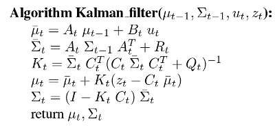
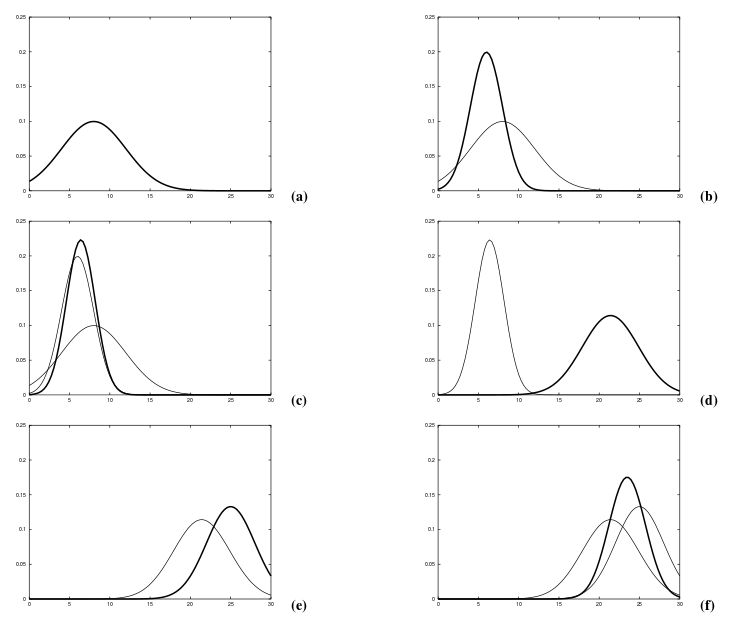
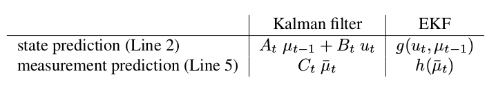

# Gaussian Filters

Gaussian techniques all sahre the basic idea that beliefs are represented by
multivariate normal distributions.

\begin{equation}
    p(x) = \text{det}(2 \pi \Sigma)^{-\frac{1}{2}}
        \text{exp}\{ -\frac{1}{2} (x - \mu)^{T} \Sigma^{-1} (x - \mu) \}
\end{equation}

This density over the variable $x$ is characterized by two sets of parameters:

- Mean $\mu$
- Covariance $\Sigma$

The covariance is a quadratic matrix that is symmetric and positive
semidefinite. Its dimension is the dimensionality of the state $x$ squwared.
Thus, the number of elements in the covariance matrix depends quadratically on
the number of elements in the state vector.

The representation of a Gaussian by its mean and covariance is called the
moments representation. This is because the mean and covariance are the first
and second moments of a probaility distribution; all other moments are zero for
normal distributions. In the following alternative representations, called
**canonical representation** or sometimes **natural representation**. Both
representations, the moments and the canonical representations, are
functionally equivalent in that a bijective mapping exists that transforms one
into the ohter (and back). However they lead to filter algorithms with
orthognal computational characteristics.

## Linear Gaussian Systems

Posteriors are Gaussian if the following three properties hold, in addition to
Markov assumptions of the Bayes filter.

1. The next state probaiblity $p(x_{t} | u_{t}, x_{t - 1})$ must be linear
   function in its arguments with added Gaussian noise. This is expressed by:

  \begin{equation}
      x_{t} = A_{t} x_{t - 1} + B_{t} u_{t} + \sigma_{t}
  \end{equation}

  Where:

    - $x_{t}$ and $x_{t - 1}$ are state vectors (column vectors)
    - $u_{t}$ is the control vector at time $t$ (column vectors)
    - $A_{t}$ is a square matrix of size $n \times n$, where $n$ is the
      dimension of the state vector $x_{t}$
    - $B_{t}$ is of size $n \times m$ with $m$ being the dimension of the
      control vector $u_{t}$. By multiplying the state and control vector with
      the matrices $A_{t}$ $B_{t}$, respectively, the state transition function
      becomes linear in its arguments. Thus KF assumes linear system dynamics.
    - $\epsilon_{t}$ is a Gaussian random vector that models the randomness in
      the state transition, it has same dimension as the state vector. Mean is
      zero and its covariance will be denoted $R_{t}$

  The state transition probability $p(x_{t} | u_{t}, x_{t - 1})$ is:

  \begin{align}
    \begin{split}
      &p(x_{t} | u_{t}, x_{t - 1}) = \\
      &\text{det}(2 \pi R_{t})^{-\frac{1}{2}}
      \text{exp}
      \{ -
      \frac{1}{2} (x_{t} - A_{t} x_{t - 1} - B_{t} u_{t})^{T}
      R_{t}^{-1}
      (x_{t} - A_{t} x_{t - 1} - B_{t} u_{t})
      \}
    \end{split}
  \end{align}

2. The measurement probability $p(z_{t} | x_{t})$ must also be **linear** in
   its arguments, with added Gaussian noise:

  \begin{equation}
    z_{t} = C_{t} x_{t} + \delta_{t}
  \end{equation}

  Here $C_{t}$ is a matrix of size $k \times n$, where $k$ is the dimension
  of the measurement vector $z_{t}$. The vector $\delta_{t}$ describes the
  measurement noise. The distribution of $\delta_{t}$ is a multivariate
  Gaussian with zero mean and covariance $Q_{t}$. The measurement probability
  is thus given by the following multivariate normal distribution:

  \begin{equation}
    p(z_{t} | x_{t}) =
    \text{det}(2 \pi R_{t})^{-\frac{1}{2}}
    \text{exp}
    \{ -
    \frac{1}{2} (z_{t} - C_{t} x_{t})^{T}
    Q_{t}^{-1}
    (z_{t} - C_{t} x_{t})
    \}
  \end{equation}

3. Finally, the intial belief $\text{bel}(x_{0})$ must be normal distributed.
   We will denote the mean of this belief by $\mu_{0}$ and the covariance by
   $\Sigma_{0}$:

  \begin{equation}
    p(x_{0}) =
    \text{det}(2 \pi \Sigma_{0})^{-\frac{1}{2}}
    \text{exp}
    \{ -
    \frac{1}{2} (x_{0} - \mu_{0})^{T}
    \Sigma_{0}^{-1}
    (x_{0} - \mu_{0})
    \}
  \end{equation}

  The above three assumptions are sufficient to ensure that the posterior
  $\text{bel}(x_{0})$ is always a Gaussian, for any point in time $t$. The
  proof will follow below.

## The Kalman Filter Algorithm

Probably the best studied technique for implementing Bayes filter is the Kalman
filter (KF). The Kalman filter was inveted in the 1950s by Rudolph Emil Kalman,
as a technique for filtering and prediction in linear systems. The Kalman
filter implements belief computation for continuous states. It is not
applicable to discrete or hybrid state spaces.

A Kalman filter is an **optimal estimator**, it infers parameters of interest
from indirect, inaccurate and uncertain observations. It is **recursive** so
tthat new measurements can be processed as they arrive. It is optimal in the
sense that if the noise is Gaussian, the Kalman filter minimises the mean
squared error of the estimated parameters.

The Kalman filter represents beliefs by the moments representation: At time
$t$, the belief is represented by the mean $\mu_{t}$ and the covariance
$\Sigma_{t}$.

The Kalman filter algorithm represent the belief $\text{bel}(x_{t})$ at time $t$
by the mean $\mu_{t}$ and the covariance $\Sigma_{t}$. The input of the Kalman
filter is the belief at time $t - 1$, represented by $\mu_{t - 1}$ and
$\Sigma_{t - 1}$. To update these parameters , Kalman filters require the
control $u_{t}$ and the measurement $z_{t}$. The output is the belief at time
$t$, represented by $\mu_{t}$ and $\Sigma_{t}$.

Once the predicted belief $\bar{\mu}$ and $\bar{\Sigma}$ are calculated,
representing belief $\overline{\text{bel}}(x_{t})$ one time step later, but
before incorporating the measurement $z_{t}$. This belief is obtained by
incorporating the control $u_{t}$. The mean is updated using the deterministic
version of the state transition function, with the mean $\mu_{t - 1}$
substituted for the state $X_{t - 1}$. The update of the covariance considers
the fact that the states depend on previous states through the linear matrix
$A_{t}$. This matrix is multiplied twice into the covariance, since the
covariance is a quadratic matrix.

The belief $\overline{\text{bel}}(x_{t})$ is subsequently transformed into the
desired belief $\text{bel}(x_{t})$ by incorporating measurement $z_{t}$. The
variable $K_{t}$, computed is called the Kalman gain. It specifies the degree
to which the measurement is incoroprated into the new state estimate. The mean
$\mu_{t}$ is then manipulated by adjusting it:

1. In proportional to the Kalman gain $K_{t}$
2. Deviation of the actual measurement $z_{t}$
3. Measurement predicted according to the measurement probability

Finally the new covariance of the posterior belief is calculated, adjusting for
the information gain resulting from the measurement.

### Example

In the following we will detail a one-dimensional localization scenario.
Suppose a robot moves along the horizontal axis in each sub-figure above. Let
the prior over the robot location be given by the normal distribution shown in
(a). The robot queries its sensors on its location and returns a measurement
that is centered at the peak of the bold Gaussian in (b). This bold Gaussian
peak is the value predicted by the sensors, and its width (variance)
corresponds to the uncertainty in the measurement.

Combining the prior with the measurement, yields the bold Gaussian in (c). This
belief's mean lies between two original means, and its uncertainty radius is
smaller than both contributing Gaussians may appear counter-intuitive, but it
is a general characteristic of information integration in Kalman filters.

Next, assume the robot moves towards the right, it's uncertainty grows due to
the fact that the next state transition is stochastic. The bolded Gaussian in
(c) depicts the Kalman Filter's estimate of the robot. Then in (e) denotes the
second measurement from the sensors.

The process continues with an alternating **measurement update step**, in which
sensor data is integrated into the present belief. With a prediction step (or
control update step), which modifies the belief in accordance to an action. The
update step decreases uncertainty and the prediction step increases uncertainty
in the robot's belief.

## Extended Kalman Filter

The assumptions of linear state transitions and linear measurements with added
Gaussian noise are rarely fulfilled in practice. For example, a robot that
moves with a constant translational rotational velocity typically moves on
a circular trajectory, which cannot be described by linear next state
transitinos. This observation, along with the assumption of unimodal beliefs,
renders plain Kalman filters, as disccussed so far in-applicable to all but the
most trivial robotics problems.

The Extended Kalman Filter (EKF) overcomes one of theses assumptions: the
linearity assumption. Here the assumption is that the next state probability
and the measurement probabilities are governed by non-linear functions $g$ and
$h$ respectively.

\begin{align}
    x_{t} &= g(u_{t} , x_{t - 1}) + \epsilon_{t} \\
    z_{t} &= h(x_{t}) + \delta_{t}
\end{align}

This model strictly generalizes the linear Gaussian model underlying Kalman
filters postulated. The function $g$ replaces the matrices $A_{t}$ and $B_{t}$,
and $h$ replaces the matrix $C_{t}$. Unfortunately, with arbitrary functions
$g$ and $h$, the belief is no longer a Gaussian. In fact, performing the belief
update exactly is usallly impossible for nonlinear functions $g$ and $h$, in
the sense that the Bayes filter does not possess a closed-form solution.

The extended Kalman filter (EKF) calculates an approximation to the true
belief. It represents this approximation by a Gaussian. In particular, the
belief $\text{bel}(x_{t})$ at time $t$ is represented by a mean $\mu_{t}$ witha
convergence $\Sigma_{t}$. Thus, the EKF inherits from the Kalman filter the
basic belief representation, but it differs in that this belief is only
approximate, not exactly as was the case in Kalman filters.

### Linearization via Taylor Expansion

The key idea underlying the EKF is called **linearization**. Suppose we
are given a  nonlinear next state function $g$. A Gaussian projected
through this function is typically non-Gaussian. This is because
nonlinearities in $g$ distort the belief in ways that destroys its nice
Gaussian shape. Linearization approximates $g$ by a linear function that
is tangent to $g$ at the mean of the Gaussian. By projecting the Gaussian
through this linear approximation, the posterior is Gaussian. In fact,
once $g$ is linearized, the mechanics of belief propagation are equivalent
to those of the Kalman filter. The same argument applies to the
multiplication of Gaussians when a measurement function $h$ is involved.
Again the EKF approximates $h$ by a lienar function tangent to $h$,
thereby retaining the Gaussian nature of the posterior belief.

There exist many technqiues for linearizing nonlinear functions. EKFs
utilize a method called (first order) Taylor expansion. Taylor expansion
construct a linear approximation to a function $g$ and $g$'s value and
slope. The slope is given by the partial derivative:

\begin{equation}
    g'(u_{t}, x_{t - 1}) :=
        \frac{\delta g(u_{t}, x_{t - 1})}{\delta x_{t - 1}}
\end{equation}

Clearly, both the value of $g$ and its slope depend on the argument of $g$.
A logical choice for selecting the argument is to chose the state deemed most
likely at the time of linearization. For Gaussians, the most likely state is
the mean of the posterior $\mu_{t - 1}$. In other words, $g$ is approximated by
its value at $\mu_{t - 1}$ (and at $\mu_{t}$), and the linear extrapolation is
achieved by a term proportional to the gradient of $g$ at $\mu_{t - 1}$ and
$\mu_{t}$.

\begin{align}
    g(u_{t}, x_{t - 1})
        &\approx
        g(u_{t}, u_{t - 1}) +  g'(u_{t}, u_{t - 1})(x_{t - 1} - \mu_{t - 1}) \\
        &=
        g(u_{t}, u_{t - 1}) +  G_{t}(x_{t - 1}, u_{t - 1})
\end{align}

Written as Gaussian, the next state probaiblity is approximated as follows,
using the Multivariate normal distribution:

\begin{equation}
    p(x) = \text{det}(2 \pi \Sigma)^{-\frac{1}{2}}
        \text{exp}\{ -\frac{1}{2} (x - \mu)^{T} \Sigma^{-1} (x - \mu) \}
\end{equation}

$\mu$ is now replaced with our approximated $g(u_{t}, x_{t - 1})$:

\begin{equation}
    g(u_{t}, u_{t - 1}) +  G_{t}(x_{t - 1}, u_{t - 1})
\end{equation}

Notice that $G_{t}$ is a matrix of size $n \times n$, with $n$ denoting the
dimension of the state. This matrix is often called the Jacobian. The value of
the Jacobian depends on $u_{t}$ and $u_{t - 1}$, hence it dfferes for different
points in time.

EKFs implement the exact same linearization for the measurement function $h$.
Here the Taylor expansion is developed around $\bar{\mu}_{t}$, the state deemed
most likely by the robot at the time it linearizes $h$:

\begin{align}
    h(x_{t})
        &\approx h(\bar{\mu}_{t}) + h'(\mu_{t})(x_{t} - \bar{\mu}_{t}) \\
        &= h(\bar{\mu}_{t}) + H_{t} (x_{t} - \bar{\mu}_{t})
\end{align}

with $h'(x_{t}) = \frac{\delta h(x_{t})}{\delta x_{t}}$. Written as a Gaussian,
we have:

\begin{align}
    p(x) =
        &\text{det}(2 \pi Q_{t})^{-\frac{1}{2}}
        \text{exp}
        \{ -\frac{1}{2}
        [z_{t} - h(\bar{\mu}_{t} - H_{t} (x_{t} - \bar{\mu}_{t})]^{T} \\
        &Q_{t}^{-1} [z_{t} - h(\bar{\mu}_{t}) -
        H_{t} (x_{t} - \bar{\mu}_{t})]^{T}]
        \}
\end{align}

### The Extended Kalman Filter Algorithm (EKF)

In many ways the EKF algorithm is similar to the Kalman filter algorithm. The
most important differences are summarized below:

That is the linear predictions in Kalman filters are replaced by their
nonlinear generalizations in EKFs. Moreover, EKFs use Jacobians $G_{t}$ and
$H_{t}$ instead of the corresponding linear system matrices $A_{t}$, $B_{t}$,
$C_{t}$ in Kalman filters. The Jacobian $G_{t}$ correspoinds to the matrices
$A_{t}$ and $B_{t}$, and the Jacobian $H_{t}$ corresponding to $C_{t}$.
