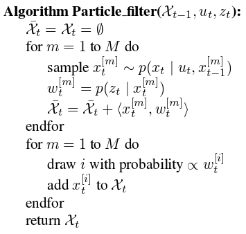

# The Particle Filter

The particle filter is an alternative nonparametric implementation of the
Bayes filter. Just like histogram filters, particle filters approximate
the posterior by a finite nubmer of parameters. However they differ in the
way these parameters are generated, an in which they populate the state
space. The key idea of the particle filter is to represent the posterior
$\text{bel}(x_{t})$ by a set of random state samples drawn from this
posterior. Instead of representing the distribution by a parametric form
(the exponential function that defines the density of a normal
distribution), particle filters represent a distribution by a set of
samples drawn from this distribution. Such a representation is
approximate, but it is nonparametric, and therefore can represent a much
broader space of distribution than, for example, Gaussians.

In particle filters, the samples of a posterior distriubtion are called
particles and are denoted:

\begin{equation}
    \chi_{t} := x^{[1]}_{t}, x^{[2]}_{t}, \dots, x^{[M]}_{t}
\end{equation}

Where each particle $x^{[m]}_{t}$ (with $1 \leq m \leq M$) is a concrete
instantiation of the state at time $t$, that is, a hypothesis as to what
the true world state may be at time $t$. Here $M$ denotes the nubmer of
particles in teh particle set $\chi_{t}$. In practice, the number of
particles $M$ is often a large number, e.g. $M = 1000$. In some
implementations $M$ is a function of $t$ or other quantities related to
the belief $\text{bel}(x_{t})$.

The intuition behind particle filters is to approximate the belief
$\text{bel}(x_{t})$ by the set of the particles $\chi_{t}$. Ideally, the
likelihood for a state hypothesis $x_{t}$ to be included in the particle set
$\chi_{t}$ shall be proportional to its Bayes filter posterior
$\text{bel}(x_{t})$:

\begin{equation}
    \label{eq:sampling}
    x^{[m]}_{t} ~ p(x_{t} \mid z_{1: t}, u_{1: t})
\end{equation}

As a consequence of \ref{eq:sampling}, the denser a subregion of the state
space is populated by samples, the more likely it is that the true state falls
into this region. This property holds only asymtotically for $M$ tends to
$\infty$ for the standard particle filter algorithm. For finite $M$, particles
are drawn from a slightly different distribution. In practice, this difference
is negligivle as long as the number of particles is not too small (e.g. $M \geq
100$).

Just like all other Bayes filter algorithms, the particle filter algorithm
constructs the belief $\text{bel}(x_{t})$ recursively from the belief
$\text{bel}(x_{t - 1})$ one time step earlier. Since beliefs are represented by
sets of particles, this means that particle filters construct the particle set
$\chi_{t}$ recursively from the set $\chi_{t - 1}$. The most basic variant of
the particle filter algorithm is:

The input of this algorithm is the particle set $\chi_{t - 1}$, along with the
most recent control $u_{t}$ and the most recent measurement $z_{t}$. The
algorithm then first constructs a temporary particle set $\bar{\chi}$ which is
reminiscent (but not equivalent) to the belief $\bar{\text{bel}}(x_{t})$. It
does this by systematically processing each particle $x^{[m]}_{t - 1}$ in the
input particle set $\chi_{t - 1}$ as follows:

- There are two for loops in the particle filter algorithm, in the first for
  loop the goal is to generate a hypothesis state $x^{[m]}_{t}$ for time $t$
  based on the particle $x^{[m]}_{t - 1}$ and the control $u_{t}$. The
  resulting sample is indexed by $m$, indicating that it is generated from the
  $m$-th particle in $\chi_{t - 1}$. This step involves sampling from the next
  state distribution $p(x_{t} \mid u_{t}, x_{t - 1})$.

  To implement this step, one needs to be able to sample from $p(x_{t} \mid
  u_{t}, x_{t - 1})$. The ability to sample from the state transition
  probability is not given for arbitrary distributions $p(x_{t} \mid u_{t},
  x_{t - 1})$. The set of particles resulting from iterating the sampling step
  $M$ times is the filter's representation of $\overline{\text{bel}}(x_{t})$.

- Once we have a sample, we calculate the importance factor for each particle
  sampled, which is denoted as $w^{[m]}_{t}$. The importance factor are used to
  incorporate the measurement $z_{t}$ into the particle set. The importance,
  thus, is the probability of the measurement $z_{t}$ udner the particle
  $x^{[m]}_{t}$, that is, $w^{[m]}_{t} = p(z_{t} \mid x^{[m]}_{t})$. If we
  interpret $w^{[m]}_{t}$ as the weight of the particle, the set of weighted
  particles represents (in approximation) the Bayes filter posterior
  $\text{bel}(x_{t})$.

- The real "trick" of the particle filter algorithm occurs in the second
  for loop, where the **resampling** or **importance resampling** part of
  the algorithm takes place. The algorithm draws with replacement $M$
  particles from the temporary set $\bar{\chi}_{t}$. The probability of
  drawing each particle is given by its importance weight. Resampling
  transforms a particle set of $M$ praticles into another particle set of
  the same size. By incorporating the imporance weights into the
  resampling process, the distribution of the particles change: whereas
  before the resampling step, they were distribution according to
  $\overline{\text{bel}}(x_{t})$, after the resampling they are
  distributed (approximately) according to the posterior $\text{bel}
  = \eta p(z_{t} \mid x^{[m]}_{t}) \overline{\text{bel}}(x_{t})$. In fact,
  the resulting sample set usually possesses many duplicates, since
  particles are drawn with replacement. More important are the particles
  that are not contrained in $\chi_{t}$: those tend to be the particles
  with lower importance weights.

The resampling step has the important function to force particles back to
teh posterior $\text{bel}(x_{t})$. In fact, an alternative (and usually
inferior) version of the particle filter would never resample, but instead
would maintain for each particle an importance weightthat is initialized
by 1 and updated multipiliciatively:

\begin{equation}
    w^{[m]}_{t} = p(z_{t} \mid x^{[m]}_{t}) w^{[m]}_{t - 1}
\end{equation}

Such a particle filter algorithm would still approximate the posterior,
but many of its partilces would end up in regions of low posterior
probability. As a result, it would require many more particles; how many
depends on the shape of the posterior. The resampling step is
a probabilistic implementation of the Darwinian idea of survival of the
fittest: it refocuses the particle set to regions in state space with high
posterior probability. By doing so, it focuses the computational resources
of the filter algorithm to regions in teh state space where they matter
the most.

## Importance Sampling

The figure above shows the intuition behind the resampling step.
Sub-figure (a) shows a density function $f$ of a probability distribution
calle dhte target distribution. What we would like to achieve is to obtain
a sample from $f$. However, sampling from $f$ directly may not be
possible. Instead, we can generate particles from a related density,
labeled $g$ in the sub-figure (b). The distribution that corresponds to
the density $g$ is called **proposal distribution**. The density $g$ must
be such that $f(x) > 0$ implies that $g(x) > 0$, so that there is
a non-zero probability to generate a particle when sampling from $g$ for
any state that might be generated by sampling from $f$. However, the
resulting particle set, shown at the bottom of sub-figure (b) is
distributed according to $g$, not to $f$. In particular, for any interval
$A \subseteq \text{range}(X)$ (or more generally, any Borel set A) the
empirical count of particles that fall into A converges to the integral of
$g$ under A.

\begin{equation}
    \dfrac{1}{M} \sum^{M}_{m = 1}
        I(x^{[m]} \in A)
        \rightarrow
        \int_{A} g(x) dx
\end{equation}

To offset this difference between $f$ and $g$, particles $x^{[m]}$ are weighed
by the quotient:

\begin{equation}
    w^{[m]} = \dfrac{f(x^{[m]})}{g(x^{[m]})}
\end{equation}

This is illustrated by sub-figure (c), where the vertical bars in (c)
indicate the magnitude of the importance weights. Importance wegiths are
the non-normalized probability mass of each particle. In particular, we
have

where the first term serves as the normalizer for all importance weights.
In other words, even though we generated the particles form the density
$g$, the appropriately weighed particles converge to the density $f$.

The specific convergence involves an integration over a set $A$. Clearly,
a particle set represents a discrete distribution, whereas $f$ is
continuous in our examplel. Because of this, there is no density that
could be associated with a set of particles. The convergence, thus, is
over the cumulative distribution function of $f$, not the density itself
(hence the integration over A). A nice property of importance sampling is
that it converges to the true density if $g(x) > 0$ whenever $f(x) > 0$.
In most cases, the rate of convergence is in $O(\frac{1}{\sqrt{M}})$,
where $M$ is the number of samples. The constant factor depends on the
similarity of $f(s)$ and $g(s)$.

In particle filters, the density $f$ correesponds to the target belief
$\text{bel}(x_{t})$. Under the (asymptotically correct) assumption that
the particles in $\chi_{t - 1}$ are distributed according to
$\text{bel}(x_{t - 1})$, the density $g$ corresponds to the product
distribution:

\begin{equation}
    p(x_{t} \mid u_{t}, x_{t - 1}) \text{bel}(x_{t - 1})
\end{equation}

this distribution is called the **proposal distribution**.

## Properties of the Particle Filter

Particle filters are approximate and as such subject to approximation
errors. There are four complimentary sources of approximation error, each
of which gives rise to improved versions of the particle filter.

1. The first approximation error relates to the fact that only finitely
   many particles are used. This artifact introduces a systematic bias in
   the posterior estimate. To see, consider the extreme case of $M = 1$
   particle. In this case, the first loop in the particle filter will only
   be executed once, and $\bar{\chi}_{t}$ will contain only a single
   particle, sampled from the motion model. The key insight is that the
   resampling step will now *deterministically* accept this sample,
   regardless of its importance factor $w^{[m]}_{t}$.

   Put differently, the measurement probability $p(z_{t} \mid x^{[m]}_{t})$
   plays no role in the result of the update, and neither does $z_{t}$. Thus,
   if $M = 1$, the particle filter generates particles from the probability

   \begin{equation}
     p(x_{t} \mid u_{1:t})
   \end{equation}

   instead of the desired posterior $p(x_{t} \mid u_{1:t}, z_{1:t})$. It
   flatly ignores all measurements. How can this happen?

   The culprit is the normalization, implicit in the resampling step. When
   sampling in proportion to the importance weights, $w^{[m]}_{t}$ becomes
   its own normalizer if $M = 1$:

   \begin{equation}
     p(\text{draw} x^{[m]}_{t}) = \dfrac{w^{[m]}_{t}}{w^{[m]}_{t}} = 1
   \end{equation}

   In general, the problem is that the non-normalized values $w_{t}[m]$ are
   drawn from an $M$-dimensional space, but after normalization they reside
   in a space of dimension $M - 1$. This is because after normalization,
   the $m$-th weight can be recovered from $M - 1$ other weights by
   subtracting those from 1. Fortunately, for values of $M$, the effect of
   loss of dimensionality, or degrees of freedom, becomes less and less
   pronounced.
