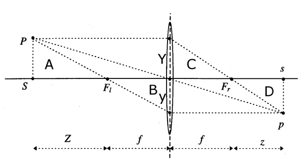

# Perspective Projection

## Mathematics of Perspective Projection

The above drawing shows the perspective projection of a point $P$ (observed
through a thin lens) to its image $p$. The point $P$ has coordinates $X = (X,
Y, Z) \in {\rm I\!R}^{3}$ relative to the reference frame centered at the
optical center, where the z-axis is the optical axis (of the lens).

To simplify equations, one flips the signs of $x$ and $y$ axes, which amoutns
to considering the image plane to be in front of the center of projection
(rather than behind it). The perspective transformation $\pi$ is therefore
given by:

\begin{equation}
    \pi : {\rm I\! R}^{3} \rightarrow {\rm I\! R}^{3};
        X \mapsto x
            = \pi(X)
            = \left (
                \begin{array}{c}
                    f \frac{X}{Z} \\
                    f \frac{Y}{Z}
                \end{array}
            \right)
\end{equation}

## An Ideal Perspective Camera

In homogeneous coordinates, the perspective transformation is given by:

\begin{equation}
    Zx = Z \left( \begin{array}{c} x \\ y \\ 1 \end{array} \right)
        =
        \left(
            \begin{array}{cccc}
                f & 0 & 0 & 0 \\
                0 & f & 0 & 0 \\
                0 & 0 & 1 & 0
            \end{array}
        \right)
        \left(
            \begin{array}{c}
                X \\
                Y \\
                Z \\
                1
            \end{array}
        \right)
        = K_{f} \sqcap_{0} X
\end{equation}

Where

\begin{equation}
    K_{f} =
        \left(
            \begin{array}{cccc}
                f & 0 & 0 & 0 \\
                0 & f & 0 & 0 \\
                0 & 0 & 1 & 0
            \end{array}
        \right)
\end{equation}

\begin{equation}
    \sqcap_{0} =
        \left(
            \begin{array}{cccc}
                1 & 0 & 0 & 0 \\
                0 & 1 & 0 & 0 \\
                0 & 0 & 1 & 0
            \end{array}
        \right)
\end{equation}

The matrix $\sqcap_{0}$ is referred to as the **standard projection matrix**.
Assuming $Z$ to be a constant $\lambda > 0$, we obtain:

\begin{equation}
    \lambda x = K_{f} \sqcap_{0} X
\end{equation}

Given that we know the rigid motion of the camera, the point $X$ in the camera
coordinates is given as a fucntion of the point in world coordinates $X_{0}$
by:

\begin{equation}
    X = R X_{0} + T
\end{equation}

or in homogeneous coordinates $X = (X, Y , Z , 1)^{T}$:

\begin{equation}
    X = g X_{0} = \left(
        \begin{array}{cc}
            R & T \\
            0 & 1
        \end{array}
    \right)
    X_{0}
\end{equation}

In total, the transformation from world coordinates to image coordinates is
therefore given by:

\begin{equation}
    \lambda x = K_{f} \sqcap_{0} X
\end{equation}

If the focal length $f$ is known, it can be noramlized to 1 (by changing the
units fo the image coordinates), such that:

\begin{equation}
    \lambda x = \sqcap_{0} X = \sqcap_{0} g X_{0}
\end{equation}

If the camera is not centered at the optical center, we have an additional
translation $o_{x}$ and $o_{y}$, and if pixel coordinates do not have unit
scale, we need to introduce an additional scaling in the $x$ and $y$ directions
by $s_{x}$ and $s_{y}$. If the pixels are not rectangular, we have a skew
factor $s_{\theta}$.

## Preimage of Points and Lines

Given $f: X \mapsto Y$, the image of $x$ is $f(x)$. The preimage of $y$ is then
$f^{-1}(y) = \{ x | f(x) = y \}$, or all $x$ whose image is $y$. Images are
elements of the range, while preimages are subsets (possibly empty) of the
domain.

The **inverse image** or **preimage** of a particular subset $S$ of the
codomain of a function is the set of all elements of the domain that map to the
members of $S$.

The perspective transformation introduced allows us to define images for
arbitrary geometric entitties by simply transforming all points of the entity.
However, due to the unknown scale factor, each point is mapped not to a single
point $x$, but to an equivalence class of points $y \sim x$. It is therefore
useful to study how lines are transformed. A line $L$ in 3D is characterized by
a base point:

\begin{equation}
    X_{0} = (X_{0}, Y_{0}, Z_{0}, 1)^{T} \in {\rm I\! R}^{4}
\end{equation}

and a vector:

\begin{equation}
    V = (V_{1}, V_{2}, V_{3}, 0)^{T} \in {\rm I\! R}^{4}
\end{equation}

gives:

\begin{equation}
    X = X_{0} + \mu V \\
    \mu \in {\rm I\! R}
\end{equation}

The image of the line $L$ is given by:

\begin{align}
    x \sim \sqcap_{0} X &= \sqcap_{0} (X_{0} + \mu V) \\
        &= \sqcap_{0} X_{0} + \mu \sqcap_{0} V
\end{align}

All points $x$ treated as vectors form the origin $o$ span a 2D subspace $P$.
The intersection of this plane $P$ with the image plane gives the image of the
line. $P$ is called the preimage of the line.

A **preimage of a point or a line** in the image plane is the largest set of 3D
points that give rise to an image equal to the given point or line.

Preimages can be defined for curves or other more complicated geometric
structures. In the case of points and lines, however, the preimage is a
subspace of ${\rm I\! R}^{3}$. This subspace can also be represented by its
orthogonal complement, i.e. the normal vector in the case of a plane. This
complement is called the coimage. The **coimage of a point or line** is the
subspace in ${\rm I\! R}^{3}$ that is the (unique) orthogonal complement of its
preimage. Image, preimage and coiamge are **equivalent** because they uniquely
determine one another:

\begin{align}
    \text{image} &= \text{preimage} \cap \text{image plane} \\
    \text{preimage} &= \text{span}(\text{image}) \\
    \text{preimage} &= \text{coimage}^{\perp} \\
    \text{coimage} &= \text{preimage}^{\perp}
\end{align}

In the case of the line $L$, the preimage is a 2D subspace, characterized by
the 1D coimage given by the span of its normal vector $l \in {\rm I\! R}^{3}$.
All points of the preimage, and hence all points $x$ of the image of $L$ are
orthogonal to $l$:

\begin{equation}
    l^{T} x = 0
\end{equation}

The sapce of all vectors orthogonal to $l$ is spanned by the row vectors of
$\hat{l}$ thus we have:

\begin{equation}
    P = \text{span}(\hat{l})
\end{equation}

In the case that $x$ is the iamge of a point $p$, the preimage is a line and
the coimage is the plane orthogonal to $x$, i.e. it is spanned by the row sof
the matrix $\hat{x}$.

In summary we have the following:

- **Image Point**: $\text{span}(x) \cap \text{image plane}$
- **Image Line**: $\text{span}(\hat{l}) \cap \text{image plane}$
- **Preimage Point**: $\text{span}(x) \subset {\rm I\! R}^{3}$
- **Preimage Line**: $\text{span}(\hat{l}) \subset {\rm I\! R}^{3}$
- **Coimage Point**: $\text{span}(\hat{x}) \subset {\rm I\! R}^{3}$
- **Coimage Line**: $\text{span}(l) \subset {\rm I\! R}^{3}$

