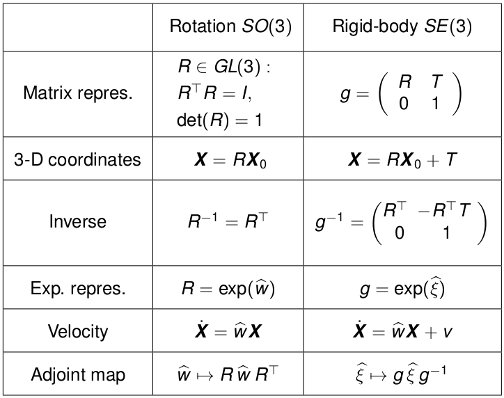

# Representing Scenes

In order to describe 3D scenes, and its objects we need to understand
differerent methods of describing and representation of them. There are several
different methods which we will briefly go through below, namely:

- 3D Space and Rigid Body Motion
- Lie Algebra and Lie Groups
- Representing the Motion of the Camera
- Summary

## 3D Space and Rigid Body Motion

### 3D Euclidean Space

The 3D Euclidean space ${\rm I\!E}^3$ consists of all points $p \in {\rm
I\!E}^3$ characterized by coordinates.

\begin{equation}
    X = (x_{1}, x_{2}, x_{3})^{T} \in {\rm I\!R}^3
\end{equation}

such that ${\rm I\!E}^3$ can be identified with ${\rm I\!R}^3$. That means we
talk about points (${\rm I\!E}^3$) and coordinates (${\rm I\!R}^3$) as if they
were the same thing. Given two points $X$ and $Y$, one can define a bound
vector as:

\begin{equation}
    v = Y - X \in {\rm I\!R}^3
\end{equation}

Considering this vector indepedent of its base point $Y$ makes it a free
vector. the set of free vectors $v \in {\rm I\!R}^3$ forms a linear vector
space. By identifying ${\rm I\!E}^3$ and ${\rm I\!R}^3$, one can endow
${\rm I\!E}^3$ with a scalar product, a norm and a metric. This allows one to
compute distances, curve lengths, areas or volumes.

### Cross-Product and Skew-Symmetric Matrices

On ${\rm I\!R}^3$ one can define a cross product

\begin{equation}
    \times : {\rm I\!R}^3 \times {\rm I\!R}^3 \rightarrow {\rm I\!R}^3
\end{equation}

Which produces a resultant vector orthogonal to the original two vectors. Since
$u \times v = -v \times u$. The cross product introduces an orientation. Fixing
$u$ induces a linear mapping $v \mapsto u \times v$ which can be represented by a
skew-symmetric matrix.

\begin{equation}
    \hat{u} =
    \begin{bmatrix}
        0 & -u_{3} & u_{2} \\
        u_{3} & 0 & -u_{1} \\
        -u_{2} & u_{1} & 0
    \end{bmatrix}
    \in {\rm I\!R}^{3 \times 3}
\end{equation}

In turn, every skew symmetric matrix $M = -M^{T} \in {\rm I\!R}^{3 \times 3}$
can be identified with a vector $u \in {\rm I\!R}^{3}$. The hat operator
$\hat{}$ defines an isomorphism between ${\rm I\!R}^{3}$ and the space of
$so(3)$ of all $3 \times 3$ skew-symmetric matrices. Its inverse is denoted by
$\vee: so(3) \rightarrow {\rm I\!R}^{3}$.

### Ridgid Body Motion

A rigid body motion (or rigid body transformation) is a family of maps:

\begin{equation}
    g_{t} : {\rm I\!R}^{3} \rightarrow {\rm I\!R}^{3}
\end{equation}

\begin{equation}
    X \mapsto g_{t}(X), t \in [0, T]
\end{equation}

Which preserve the norm and cross product of any two vectors

\begin{equation}
    |g_{t}(v)| = |v|,
        \forall v \in {\rm I\!R}^{3} \\
    g_{t}(u) \times g_{t}(v) = g_{t}(u \times v),
        \forall u, v \in {\rm I\!R}^{3}
\end{equation}

Since norm and scalar product are related by the polarization identity

\begin{equation}
    \langle u, v \rangle = \dfrac{1}{4} (|u + v|^{2} - |u - v|^{2})
\end{equation}

one can also state that a rigid body motion is a map which preserves inner
product and cross product. As a consequence, rigid body motions also preserve
the triple product

\begin{equation}
    \langle g_{t}(u), g_{t}(v) \times g_{t}(w) \rangle =
        \langle u, v \times w \rangle,
            \forall u, v, w \in {\rm I\!R}^{3}
\end{equation}

which means that they are volume-preserving.

Since rigid body transformation preserve lenths and orientation, the motion
$g_{t}$ of a rigid body is sufficiently defined by specifying the motion of a
Cartesian coordinate frmae attached to the object (given by an origin and
orthonormal oriented vectors $e_{1}, e_{2}, e_{3} \in {\rm I\!R}^{3}$). The
motion of the origin can be represented by a translation $T \in {\rm
I\!R}^{3}$, where as the transformation of the vectors $e_{i}$ is given by new
vectors $r_{i} = g_{t}(e_{i})$.

Scalar and cross product of these vectors are preserved:

\begin{align}
    r_{i}^{T} r_{j} &= g_{t}(e_{i})^{T} g_{t}(e_{j}) \\
        &= e_{i}^{T} e_{j} \\
            &= \delta_{ij} \\
    r_{1} \times r_{2} &= r_{3}
\end{align}

The first constraint amounts to the statement that the matrix $R = (r_{1},
r_{2}, r_{3})$ is an orthogonal (rotation) matrix: $R^{T} R = RR^{T} = I$,
whereas the second proerty implies that $det(R) = +1$, in other words: $R$ is
an element of the group $SO(3) = { R \in {\rm I\!R}^{3 \times 3} | R^{T} R = I,
\det(R) = +1}$

Thus the rigid body motion $g_{t}$ can be written as:

\begin{equation}
    g_{t} = Rx + T
\end{equation}

### Exponential Coordinates of Rotation

We will now derive a representation of an infinitesimal rotation. To this end,
consider a family of rotation matrices $R(t)$ which continuously transform a
point from its original location (R(0) = I) to a different one.

\begin{equation}
    X_{trans}(t) = R(t) X_{orig}, R(t) \in SO(3)
\end{equation}

Since $R(t)R(t)^{T} = I, \forall t$ we have:

\begin{equation}
    \dfrac{d}{dt} (RR^{T}) = \dot{R}R^{T} + R^{T}\dot{R} = 0 \\
    \dot{R}R^{T} = -(\dot{R}R^{T})^{T}
\end{equation}

Thus, $\dot{R}R^{T}$ is a skew-symmetric matrix. As mentioned previously the
hat operator $\hat{}$ implies there exists a vector $w(t) \in {\rm I\!R}^{3}$
such that:

\begin{equation}
    \dot{R}(t) R^{T}(t) = \hat{w}(t) \\
    \dot{R}(t) = \hat{w}(t) R(t) \\
\end{equation}

Since $R(0) = I$ it follows that $\dot{R}(0) = \hat{w}(0)$ therefore the
skew-symmetric matrix $\hat{w}(0) \in so(3)$ gives the first order
approximation of a rotation:

\begin{equation}
    R(dt) = R(0) + dR = I + \hat{w}(0) dt
\end{equation}

## Lie Algebra and Lie Groups

In the previous section we showed that effect of any infinitesimal rotation $R
\in SO(3)$ can be approximated by an element from the space of skew-symmetric
matrices

\begin{equation}
    so(3) = \{ \hat{w} | w \in {\rm I\!R}^{3} \}
\end{equation}

- The rotation group $SO(3)$ is called a Lie group
- The space $so(3)$ is called its Lie algebra

A Lie group (or infinitesimal group) is a smooth manifold that is also a group,
such that the group operations multiplication and inversion are smooth maps.

As shown: The Lie algebra $so(3)$ is the tangent space at the identity of the
rotation group $SO(3)$.

An algebra over a field $K$ is a vector space $V$ over $K$ with multiplication
on the space $V$. Elements $\hat{w}$ and $\hat{v}$ of the Lie algebra generally
do not commute. One can define the Lie bracket as:

\begin{equation}
    [ . , . ] : so(3) \times so(3) \rightarrow so(3) \\
    [ \hat{w} , \hat{v} ] = \hat{w} \hat{v} - \hat{v} \hat{w}
\end{equation}

Marius Sophus Lie was a Norwegian-born mathematician, he created the theory of
continuous symmetry, and applied it to the study of geometry and differential
equations. Among his greatest achievements was the discvery of continuous
transformation groups are better understood in their linearized versions. These
infinitesimal generators form a structure which today known as Lie algebra. The
linearized version of the group law corresponds to an operation on the Lie
algebra known as commutator bracket or Lie bracket.

### The Exponential Map

Given the infinitesimal formulation of rotation in terms of the skew symmetric
matrix $\hat{w}$, is it possible to determine a useful representation of the
rotation $R(t)$? Let us assume $\hat{w}$ is constant in time, the differential
equation system:

\begin{equation}
    \left \{
        \begin{array}{11}
            \dot{R}(t) = \hat{w} R(t) \\
            R(0) = I
        \end{array}
    \right .
\end{equation}

has the solution:

\begin{align}
    R(t) &= e^{\hat{w} t} \\
        &= \Sigma_{n = 0}^{\infty} \dfrac{(\hat{w} t)^{n}}{n!} \\
        &= I + \hat{w} t + \dfrac{(\hat{w} t)^{2}}{2!} + \dots
\end{align}

which is a rotation around the axis $w \in {\rm I\!R}^{3}$ by an angle of $t$
(if $||w|| = 1$). Aternatively, one can absorb the scalar $t \in {\rm I\!R}$
into the skew symmetric matrix $\hat{w}$ to obtain $R(t) = e^{\hat{v}}$ with
$\hat{v} = \hat{w} t$. This matrix exponential therefore defines a map from the
Lie algebra to the Lie group.

\begin{equation}
    exp : so(3) \rightarrow SO(3); \hat{w} \mapsto e^{\hat{w}}
\end{equation}

### The Logarithm of $SO(3)$

As in the case of real analysis ne can define an inverse function to the
exponential map by the logarithm. In the context of Lie groups, this will lead
to a mapping from the Lie group to the Lie algebra. For any rotation matrix $R
\in SO(3)$, there exists a $w \in {\rm I\!R}^{3}$ such that $R = exp(\hat{w})$.
Such an element is denoted by $\hat{w} = log(R)$.

If $R = (r_{ij}) \neq I$ then an appropriate $w$ is given by:

\begin{align}
    |w| &= \cos^{-1}(\dfrac{tr(R) - 1}{2}) \\
    \dfrac{w}{|w|} &= \dfrac{1}{2 \sin(|w|)} \left(
            \begin{array}{11}
                r_{32} - r_{23} \\
                r_{13} - r_{31} \\
                r_{21} - r_{12}
            \end{array}
        \right)
\end{align}

For $R = I$, we have $|w| = 0$, i.e. a rotation by an angle 0. The above
statement says: Any orthogonal transformation $R \in SO(3)$ can be realized by
rotating by an angle $|w|$ around an axis $\dfrac{w}{|w|}$ as defined above.

Obviously the above representation is not unique since increasing the angle by
multiples of $2 \pi$ will give the same rotation $R$.

### Schematic Visualization of Lie Group and Lie Algebra

- **Lie Group**: is a smooth manifold that is also a group, such that the group
  operations multiplcation and inversion are smooth maps.

- **Lie Algebra**: is the tangent space to a Lie Group at the identity element.

The mapping from Lie Algebra to Lie Group is called the **exponential map**,
the inverse is called the **logarithm**.

### Representation of Rigid Body Motions $SE(3)$

We have seen that motion of a rigid body is uniquely determined by specifying
the translation $T$ of any given point and a rotation matrix $R$ defining the
transformation of an oriented Cartesian coordinate frame at the given point.
Thus the space of rigid-body motions given by the group of special Euclidean
transformations:

\begin{equation}
    SE(3) =
        \left \{
            \left. g = (R, T) \right|
            R \in SO(3),
            T \in {\rm I\!R}^{3}
        \right
    \}
\end{equation}

in homogeneous coordinates we have:

\begin{equation}
    SE(3) =
        \left \{
            \left.
                g =
                    \left(
                        \begin{array}{cc}
                            R & T \\
                            0 & 1
                        \end{array}
                    \right)
            \right| R \in SO(3), T \in {\rm I\!R}^{3}
        \right \}
        \subset {\rm I\!R}^{4 \times 4}
\end{equation}

In the context of rigid motions one can see the difference between points in
${\rm I\!E}^{3}$ (which can be rotated and translated) and vectors in ${\rm
I\!R}^{3}$ (which can only be rotated).

### The Lie Algebra of Twists

Given a continuous family of rigid-body transformations

\begin{equation}
    g: {\rm I\!R} \rightarrow SE(3) \\
    g(t) =
        \left(
            \begin{array}{cc}
                R(t) & T(t) \\
                0 & 1
            \end{array}
        \right)
    \in {\rm I\!R}^{4 \times 4}
\end{equation}

We consider:

\begin{equation}
    \dot{g} g^{-1}(t)
        \left(
            \begin{array}{cc}
                \dot{R} R^{t} & \dot{T} - \dot{R}R^{T}T \\
                0 & 0
            \end{array}
        \right)
    \in {\rm I\!R}^{4 \times 4}
\end{equation}

As in the case of $SO(3)$, the matrix $\dot{R}R^{T}$ corresponds to some
skew-symmetric matrix $\hat{w} \in so(3)$. Defining a vector
$v(t) = \dot{T}(t) - \hat{w}(t) T(t)$, we have:

\begin{equation}
    \dot{g} g^{-1}(t)
        \left(
            \begin{array}{cc}
                \hat{w}(t) & v(t) \\ 
                0 & 0
            \end{array}
        \right)
    = \hat{\xi}(t) \in {\rm I\!R}^{4 \times 4}
\end{equation}

Multiplying with $g(t)$ from the right, we obtain

\begin{equation}
    \dot{g} = \dot{g} g^{-1} g = \hat{\xi} g
\end{equation}

The $4 \times 4$ matrix $\hat{\xi}$ can be viewed as a tangent vector along the
curve $g(t)$. $\hat{\xi}$ is called a **twist**. As in the case of $so(3)$, the
set of all twists forms a tangent space which is the Lie algebra.

\begin{equation}
    se(3) =
        \left \{
            \left.
            \hat{\xi} = \left(
                \begin{array}{cc}
                    \hat{w} & v \\
                    0 & 0
                \end{array}
            \right)
            \right| \hat{w} \in so(3),
            v \in {\rm I\!R}^{3}
        \right \}
        \subset {\rm I\!R}^{4 \times 4}
\end{equation}

to the Lie group $SE(3)$.

As before we can define the operators $\wedge$ and $\vee$ to convert between a
**twist $\hat{\xi} \in se(3)$** and its **twist coordinates $\xi \in {\rm
I\!R}^{6}$**.

\begin{equation}
    \hat{\xi} =
        \left(
            \begin{array}{c}
                v \\
                w
            \end{array}
        \right)^{\wedge}
        =
        \left(
            \begin{array}{cc}
                \hat{w} & v \\
                0 & 0
            \end{array}
        \right) \in {\rm I\!R}^{4 \times 4}
\end{equation}

\begin{equation}
    \xi =
        \left(
            \begin{array}{cc}
                \hat{w} & v \\
                0 & 0
            \end{array}
        \right)^{\vee}
        =
        \left(
            \begin{array}{c}
                v \\
                w
            \end{array}
        \right) \in {\rm I\!R}^{6}
\end{equation}

### Exponential Coordinates for $SE(3)$

The twist coordinates $\xi = \left( \begin{array}{c} v \\ w \end{array}
\right)$ are formed by stacking the **linear velocity $v \in {\rm I\!R}^{3}$**
(related to translation) and the **angular velocity $w \in {\rm I\!R}^{3}$**
(related to rotation).

The differential equation system

\begin{equation}
    \left\{
        \begin{array}{cc}
            \dot{g}(t) = \hat{\xi} g(t), & \hat{\xi} = \text{const} \\
            g(0) = I
        \end{array}
    \right.
\end{equation}

has the solution

\begin{equation}
    g(t) = e^{\hat{\xi} t} =
        \sum_{n = 0}^{\infty}
        \dfrac{(\hat{\xi} t)^{n}}{n!}
\end{equation}

For $w = 0$, we have

\begin{equation}
    e^{\hat{\xi}} =
        \left(
            \begin{array}{cc}
                I & v \\
                0 & 1
            \end{array}
        \right)
\end{equation}

While for $w \neq 0$ one can show:

\begin{equation}
    e^{\hat{\xi}} =
        \left(
            \begin{array}{cc}
                e^{\hat{\xi}} &
                    \dfrac{(I - e^{\hat{\xi}}) \hat{w} v + ww^{T} v}{|w|^{2}}
                    \\
                0 & 1
            \end{array}
        \right)
\end{equation}

The above shows that the exponential map defines a transformation from the Lie
algebra $se(3)$ to the Lie group $SE(3)$:

\begin{equation}
    exp : se(3) \rightarrow SE(3); \hat{\xi} \mapsto e^{\hat{\xi}}
\end{equation}

The elements $\hat{\xi} \in se(3)$ are called the **exponential coordinates**
for $SE(3)$.

**Conversely**: For every $g \in SE(3)$ there exist twist coordinates $\xi =
(v, w) \in {\rm I\!R}^{6}$ such that $g = exp(\hat{\xi})$.

**Proof**: Given $g = (R,  T)$, we know that there exists $w \in {\rm
I\!R}^{3}$ with $e^{\hat{w}} = R$. If $|w| \neq 0$, the expoenential form of
$g$ introduced above shows that we merely need to solve the equation

\begin{equation}
    \dfrac{(I - e^{\hat{w}}) \hat{w} v + ww^{T} v}{|w|^{w}} = T
\end{equation}

for the velocity vector $v \in {\rm I\!R}^{3}$. Just as in the case of $SO(3)$,
this representation is generally not unique, i.e. there exists many twist
$\hat{\xi} \in se(3)$ which represent the same rigid-body motion $g \in SE(3)$.

## Representing the Motion of the Camera

When observing a scene from a moving camera, the coordinates and velocities of
points in camera coordinates will change. We will use a rigid-body
tranformation:

\begin{equation}
    g(t) =
        \left(
            \begin{array}{cc}
                R(t) & T(t) \\
                0 & 1
            \end{array}
        \right)
        \in SE(3)
\end{equation}

to represent the motion from a fixed world frame to the camera frame at time
$t$. In particular we assume that at time $t = 0$ the camera frame coincides
with the world frame, i.e. $g(0) = I$, fo any point $X_{0}$ in world
coordinates, its coordinates in the camera frame at time $t$ are:

\begin{equation}
    X(t) = R(t) X_{0} + T(t)
\end{equation}

or in the homogeneous representation:

\begin{equation}
    X(t) = g(t) X_{0}
\end{equation}

### Concatenation of Motion over Frames

Given two different times $t_{1}$ and $t_{2}$, we denote the tranformation from
the points in frame $t_{1}$ to the points in frame $t_{2}$ by $g(t_{2},
t_{1})$:

\begin{equation}
   X(t_2) = g(t_2, t_1) X(t_1)
\end{equation}

Obviously we have:

\begin{align}
    X(t_3)
        &= g(t_3, t_2) X(t_2) \\
        &= g(t_3, t_2) g(t_2, t_1) X(t_1) \\
        &= g(t_3, t_1) X(t_1)
\end{align}

and thus:

\begin{equation}
    g(t_3, t_1) = g(t_3, t_2) g(t_2, t_1)
\end{equation}

by transferring the coordinates of frame $t_1$ to coordinates in frame $t_2$
and back, we see that:

\begin{align}
     X(t_1)
        &= g(t_1, t_2) X(t_2) \\
        &= g(t_1, t_2) g(t_2, t1) X(t_1)
\end{align}

which must hold for any point coordinates $X(t_1)$, thus:

\begin{equation}
    g(t_1, t_2) g(t_2, t_1) = I
    \Longleftrightarrow
    g^{-1}(t_2, t_1) = g(t_1, t_2)
\end{equation}

### Rules of Velocity Transformation

The coordinates of point $X_0$ in frame $t$ are given by $X(t) = g(t) X_0$.
Therefore the velocity is given by:

\begin{align}
    \dot{X}(t)
        &= \dot{g}(t) X_0 \\
        &= \dot{g}(t) g^{-1}(t) X(t)
\end{align}

By introducing **twist coordinates**

\begin{align}
    \hat{V}(t) &= \dot{g}(t) g^{-1}(t) \\
        &= \left(
            \begin{array}{cc}
                \hat{w}(t) & v(t) \\
                0 & 0
            \end{array}
        \right)
        \in se(3)
\end{align}

we get the expression:

\begin{equation}
    \dot{X}(t) = \hat{V}(t) X(t)
\end{equation}

In simple 3D-coordinates this gives:

\begin{equation}
    \dot{X}(t) = \hat{w}(t) X(t) + v(t)
\end{equation}

The symbol $\hat{V}(t)$ therefore represents the relative velocity of the world
frame as viewed from the camera frame.

### Transfer Between Frames: The Adjoint Map

Suppose that a viewer in another frame $A$ is displaced relative to the current
frame by a transformation $g_{xy}: Y = g_{xy} X(t)$. Then the velocity in this
new frame is given by:

\begin{align}
    \dot{Y}(t)
        &= g_{xy} \dot{X}(t) \\ 
        &= g_{xy} \hat{V}(t) X(t) \\
        &= g_{xy} \hat{V}(t) g_{xy}^{-1} Y(t)
\end{align}

this shows that the relative velocity of points observed from camera frame $A$
is represented by the twist:

\begin{align}
    \hat{V}_{y}
        &= g_{xy} \hat{V} g_{xy}^{-1} \\
        &= \text{ad}_{g_{xy}}(\hat{V})
\end{align}

where we have introduced the **adjoint map on $se(3)$**:

\begin{equation}
    \text{ad}_{g}: se(3) \rightarrow se(3);
        \hat{\xi} \mapsto g \hat{\xi} g^{-1}
\end{equation}

## Summary

