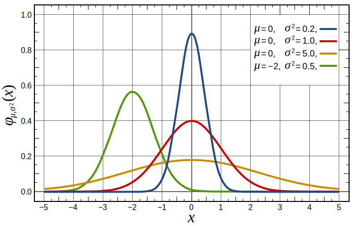

# Gaussian Distribution

The Gaussian distribution is a continuous function which approximates the exact
binomial distribution of evens. The Gaussian distribution shown is normalized
so that the sum over all values of $x$ gives a probability of $1$.

The normal distribution is useful because of the central limit theorem which
states that given certain conditions, the arithmetic mean of a sufficiently
large number of iterates of independent random variables, each with a well
defined expected value and well defined variance will be approximately normally
distributed.

The probability density of the normal distribution is:

\begin{equation}
    f(x \mid \mu, \sigma) =
        \frac{1}{\sigma \sqrt{2 \pi}}
            e^{-\frac{(x - \mu)^{2}}{2 \sigma^{2}}}
\end{equation}

where:

- $\mu$ is the mean or expectation value
- $\sigma$ is the standard deviation
- $\sigma^{2}$ is the variance
