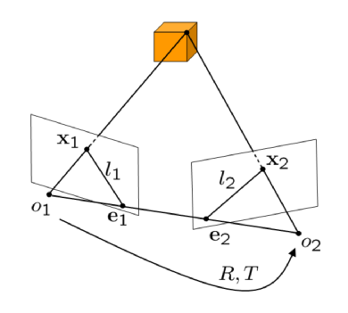

# Reconstruction From Two Views

Contents:

- The Reconstruction Problem
- Epipolar Geometry
- The Epipolar Constraint
- A Basic Reconstruction Algorithm
- The Eight-Point Algorithm
- Structure Reconstruction
- Four-Point Algorithm
- The Uncalibrated Case

In the following we will be tackling the problem of reconstructing 3D geometry
of cameras and points. To this end, we will make the following assumptions:

- Assume that we are given a set of corresponding points in two frames taken
  with the same camera from different vantage points.

- Assume that the scene is tatic, i.e. none of the observed 3D points moved
  during the camera motion.

- Assume that the intrinsic camera (calibration) parameters are known.

We will first estimate the **camera motion** form the set of corresponding
points.  Once we known the relative location and orientation of the cameras, we
reconstruct the 3D location of all corresponding points by **triangulation**.

## The Reconstruction Problem

In general 3D reconstruction is a challenging problem. If we are given two
views with 100 feature points in each of them, then we have 200 point
coordinates in 2D. The goal is to estimate

- 6 parameters modeling the camera motion $R$ and $T$
- $100 \times 3$ coordinates for the 3D points $X_{j}$

This could be done by minimizing the **projection error**:

\begin{equation}
    E(R, T, X_{1}, \dots, X_{100}) =
        \sum_{j} || x_{1}^{j} - \pi(X_{j}) ||^{2} +
            || x_{2}^{j} - \pi(R, T, X_{j}) ||^{2}
\end{equation}

This amounts to a difficult optimization problem called bundle adjustment.

Before we look into this problem, we will first study an elegant solution to
entirely get rid of the 3D point coordinates. It leads to the well-known
8-point algorithm.

## Epipolar Geometry

The projections of a point $X$ onto the two images are denoted by $x_{1}$ and
$x_{2}$. The optical centers of each camera are denoted by $o_{1}$ and $o_{2}$.
The intersections of the line $(o_{1}, o_{2})$ with each image plane are called
the epipoles $e_{1}$ and $e_{2}$. The intersections between the epipolar plane
$(o_{1}, o_{2}, X)$ and the image planes are called epipolar lines $l_1$ and
$l_2$. There is one epipolar plane for each 3D point $X$.

## The Epipolar Constraint

We know that $x_{1}$ (in homogeneous coordinates) is the projection of a 3D
point $X$. Given known camera parameters $(K = 1)$ and no rotation or
translation of the first camera, we merely have a projection with unknown depth
$\lambda_{1}$. From the first to the second frame we additionally have a camera
rotation $R$ and translation $T$ followed by a projection. This gives the
equations:

\begin{equation}
    \lambda_{1} x_{1} = X
\end{equation}

\begin{equation}
    \lambda_{2} x_{2} = RX + T
\end{equation}

Inserting the first equation into the second, we get:

\begin{equation}
    \lambda_{2} x_{2} = R(\lambda_{1}, x_{1}) + T
\end{equation}

Now we remove the translation by multiplying with $\hat{T}$ where $(\hat{T} v =
T \times v)$:

\begin{equation}
    \lambda_{2} \hat{T} x_{2} = \lambda_{1} \hat{T} R x_{1}
\end{equation}

And projection onto $x_{2}$ gives the **Epipolar Constraint**:

\begin{equation}
    x_{2}^{\top} \hat{T} R x_{1} = 0
\end{equation}

This constraint provides a relation between the 2D point coordinates of a 3D
point in each of the two images and the camera transofrmation parameters. The
original 3D point coordinates have been removed. The matrix

\begin{equation}
    E = \hat{T} R
        \quad \in {\rm I\!R}^{3 \times 3}
\end{equation}

is called the **Essential Matrix**. The epipolar constraint is also knwon as
the **essential contraint** or **bilinear constraint**.

Geometrically, this constraint states that the three vectors $\vec{o_{1} X}$,
$\vec{o_{2} o_{1}}$ and $\vec{o_{2} X}$ form a plane, i.e. the triple rpoduct
of these vectors (measuring the volume of the parallelepiped) is zero: in
coordinates of the second frame $R x_{1}$ gives the direction of the vector
$\vec{o_{1} X}; T$ gives the direction of $\vec{o_{2} o_{1}}$ and $x_{2}$ is
proportional to the vector $\vec{o_{2} X}$ such that

\begin{align}
    \text{volume} &= x_{2}^{\top} (T \times R x_{1}) \\
                  &= x_{2}^{\top} \hat{T} R x_{1} \\
                  &= 0
\end{align}

### Properties of the Essential Matrix $E$

The space of all essential Matrices is called the **essential space**:

\begin{equation}
    \epsilon = \{ \hat{T} R | R \in SO(3), T \in {\rm I\!R}^{3} \}
        \quad \subset {\rm I\!R}^{3 \times 3}
\end{equation}

Theorem [Huang & Faugeras, 1989] (Characterization of the essential matrix): A
nonzero matrix $E \in {\rm I\!R}^{3 \times 3}$ is an essential matrix if and
only if $E$ has a Singular Value Decomposition (SVD) $E = U \Sigma V^{\top}$
with:

\begin{equation}
    \sum = \text{diag}\{\sigma, \sigma, 0\}
\end{equation}

for some $\sigma > 0$ and $U, V \in SO(3)$.

Theorem (Pose recovery from the essential matrix): There exist exactly two
relative pose $(R, T)$ with $R \in SO(3)$ and $T \in {\rm I\!R}^{3}$
corresponding to an essential matrix $E \in \epsilon$. For $E = U \Sigma
V^{\top}$ we have:

\begin{align}
    (\hat{T}_{1}, R_{1}) &= (U R_{Z} (+\dfrac{\pi}{2}) \Sigma U^{\top},
        U R_{Z}^{\top} (+\dfrac{\pi}{2}) V^{\top}), \\
    (\hat{T}_{2}, R_{2}) &= (U R_{Z} (-\dfrac{\pi}{2}) \Sigma U^{\top},
        U R_{Z}^{\top} (-\dfrac{\pi}{2}) V^{\top}),
\end{align}

In general, only one of theses gives meaningful (positive) depth values.

## A Basic Reconstruction Algorithm

2D coordinates of each 3D point are coupled to the camera parameters $R$ and
$T$ through an epipolar constraint. In the following, we will derive a 3D
reconstruction algorithm which proceeds as follows:

1. **Recover the Essential Matrix $E$**: from the epipolar constraints
   associated with a set of point pairs.

2. **Extract the relative translation and rotation**: from the essential matrix
   $E$.

In general, the matrix $E$ recovered from a set of epipolar constraints will
not be an essential matrix. One can resolve this problem in two ways:

1. Recover some matrix $E \in {\rm I\!R}^{3 \times 3}$ from the epipolar
   constraints and then project it onto the essential space.

2. Optimize the epipolar constraints in the essential space.

While the second approach is in principle more accurate it involves a nonlinear
constrained optimization. We will pursue the first appraoach which is simpler
and faster.
