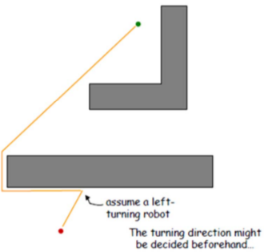
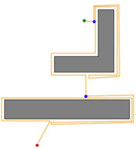
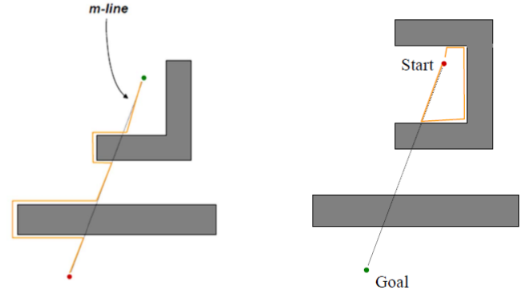
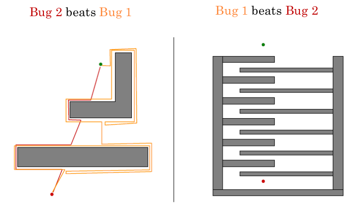

# Bug Algorithms

Simplest form of path planning from the implementation point of view, as
it assumes very little of the environment or state of which the agent is
in.

## Bug 0

Requires the knowledge of goal and robot location, the agent must also be
able to follow obstacle boundaries. The Bug 0 algorithm has the following
properties:

- Always head directly to goal
- If blocked turn and follow obstacle until you can head directly towards
  goal again. Turn direction set by user.
- Does not always work

## Bug 1

Similar to Bug 0, but this time:

- When blocked, circumbent obstacle, remember closest point
- Return to closest point and continue to goal
- Guaranteed arrival
- Can be slow

## Bug 2

Similar to Bug 0 and Bug 1, however this time:

- Head toward goal, track start-goal line (m-line)
- When blocked, circumvent obstacle until reaching m-line.
- Try both directions if necessary
- Continue to goal

## Comparision between Bug 1 and Bug 2

As you can see, there are no clear winner.
