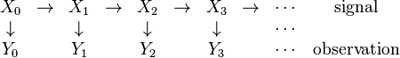

# Particle Filter

Particle filter is a non-parametric method in solving filtering problem. It
uses a sampling approach, with a set of particles to represent the posterior
distribution of some stocahstic process given some noisy and/or partial
observations. The state-space model can be nonlinear and the initial state and
noise distributions can take any form required. Particle filter techniques
provide a well-established methodology for generating samples from the required
distribution without requiring assumptions about the state-space model or the
state distributions. However, these methods do not perform well when applied to
very high dimensional systems.

## Objective

The objective of a particle filter is to estimate the posterior density of the
state variables given the observation variables. The particle filter is
designed for a hidden Markov Model, where the system consists of hidden and
observable variables. The observable variables (observation process) are
related to the hidden variables (state-process) by some functional form that is
known. Similarly the dynamical system describing the evolution of the state
variables is also known probabilistically.

A generic particle filter estimates the posteriror distribution of the hidden
states using the observation measurement process. Consider a state-space shown.

The filtering problem is to estimate sequentially the values of the hidden
states $X_{k}$, given the values of the observation process $Y_0, \dots,
Y_{k}$, at any time step $k$. All Bayesian estimates of $X_{k}$ follow from the
posterior density $p(X_{k} \mid Y_{0}, Y_{1}, \dots, Y_{k})$. The particle
filter methodology provides an approximation of these conditional probabilities
using the empirical measure.

